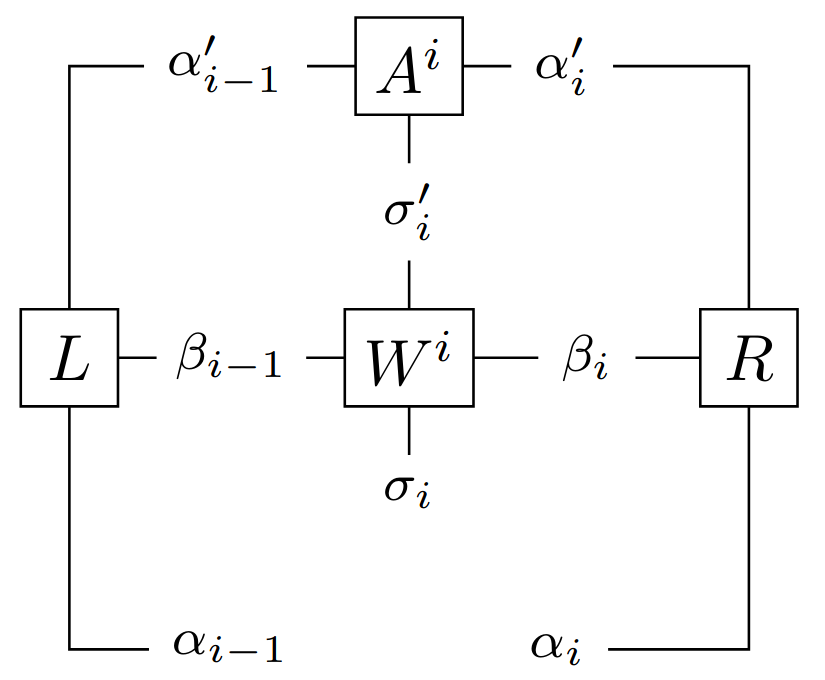

# tensorbench

A code to benchmark a tensor contraction that is common in DMRG codes:

Note: In DMRG codes, the increase of quantum entanglement between subsystems leads to a growth in the  MPS *bond dimension*, denoted $\chi = \dim(\alpha)$.

In the example below, we fix the following dimensions:

* $\dim(\alpha) = \chi = 1024$
* $\dim(\sigma) = 2$
* $\dim(\beta) = 14$ (the *virtual bond dimension* of the MPO Hamiltonian)

and compare C++ `float` (FP32), `double` (FP64) and `std::complex<double>` (CX64).

A table of the hardware and properties. The host memory bandwidth was measured on each node with the command `sysbench memory --memory-block-size=1M --memory-total-size=64G --memory-oper=read run`. The GPU bandwidth listed here is from the manufacturer's website.

